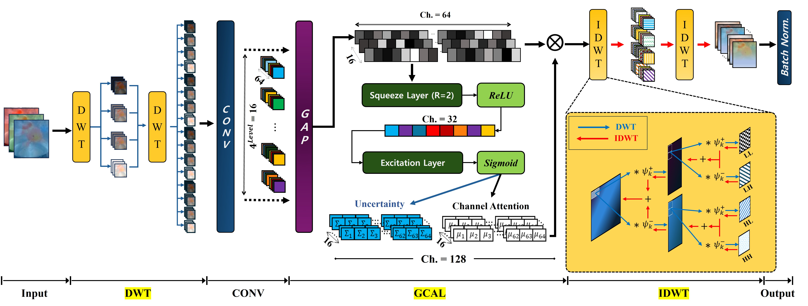

# L-TTA: Lightweight Test-Time Adaptation Using a Versatile Stem Layer (NeurIPS 2024)
This repository provides the official PyTorch implementation of the following paper:

<p align="center">
  
</p>

## **Abstract:** 
*Test-time adaptation (TTA) is the most realistic methodology for adapting deep learning models to the real world using only unlabeled data from the target domain. Numerous TTA studies in deep learning have aimed at minimizing entropy. However, this necessitates forward/backward processes across the entire model and is limited by the incapability to fully leverage data based solely on entropy. This study presents a groundbreaking TTA solution that involves a departure from the conventional focus on minimizing entropy. Our innovative approach uniquely remodels the stem
layer (i.e., the first layer) to emphasize minimizing a new learning criterion, namely, uncertainty. This method requires minimal involvement of the
model’s backbone, with only the stem layer participating in the TTA process. This approach significantly reduces the memory required for training and enables rapid adaptation to the target domain with minimal parameter updates. Moreover, to maximize data utility, the stem layer applies a discrete wavelet transform to the input features. It extracts multi-frequency domains and focuses on minimizing their individual uncertainties. The proposed method integrated into ResNet-26 and ResNet-50 models demonstrates its robustness by achieving state-of-the-art TTA performance while using the least amount of memory compared to existing studies on CIFAR-10-C, CIFAR-100-C, and Cityscapes-C benchmark datasets.*

## Environment Setup and Installation Guide
### Installation

Easy conda environment setting: you only need to import robust2.yaml.

```
 $ conda env create --name robust2 --file=robust2.yaml
 $ conda activate robust2
```

The easiest way to install pytorch_wavelets for DWT operations (i.e., 2D)

```
 $ git clone https://github.com/fbcotter/pytorch_wavelets.git
 $ cd pytorch_wavelets
 $ pip install .
```

## How to TTA

### TTA
You can easily perform the TTA process with the script files
Only by changing the code in brackets

### Data Preparation

+ [Dataset] CIFAR-10-C 
    + Download Link: (https://zenodo.org/records/2535967)
+ [Dataset] ImageNet-C 
    + Download Link: (https://zenodo.org/records/2235448)

+ [Pretrained Model] ResNet-26 Model (CIFAR-10-C) and ResNet-50 Model (ImageNet-C) 
    + Download Link: (https://zenodo.org/records/13917882)

+ Template
```
bash [SCRIPT_FILE] [GPU_NUM] [NUM_ITER] [SEED] [RESULT_CSV_PATH] [WEIGHT_FILE] [CORRUPTION_IMG_ROOT]
```

+ ImageNet-C on ResNet50
```
# DEL + GCAL
bash scripts/imgnet_r50_del_gcal.sh 0 10 42 L_TTA_R50_ImgNet_Results ResNet50/L_TTA.pth.tar /home/dataset/imagenet-c

# GCAL Only
bash scripts/imgnet_r50_gcal.sh 0 10 42 L_TTA_GCAL_ONLY_R50_ImgNet_Results ResNet50/L_TTA_SE_ONLY.pth.tar /home/dataset/imagenet-c

```
+ CIFAR-10-C on ResNet26
```
# DEL + GCAL
bash scripts/imgnet_r26_del_gcal.sh 1 20 42 L_TTA_R26_C10_Results ResNet26/L_TTA.pth.tar /home/dataset/test-C-10

# GCAL Only
bash scripts/imgnet_r26_gcal.sh 1 20 42 L_TTA_GCAL_ONLY_R26_C10_Results ResNet26/L_TTA_SE_ONLY.pth.tar /home/dataset/test-C-10
```

## Citation

If you find this repository helpful in your research, please consider citing our paper:
```bibtex
@inproceedings{
anonymous2024ltta,
title={L-{TTA}: Lightweight Test-Time Adaptation Using a Versatile Stem Layer},
author={Anonymous},
booktitle={The Thirty-eighth Annual Conference on Neural Information Processing Systems},
year={2024},
url={https://openreview.net/forum?id=G7NZljVOol}
}
```

## Acknowledgments
Our pytorch implementation is heavily derived from [TIMM](https://github.com/huggingface/pytorch-image-models), [Pytorch Wavelets](https://github.com/fbcotter/pytorch_wavelets).

Thanks to the TIMM, and Pytorch_Wavelets implementations.